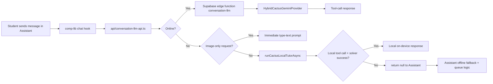

# Lumina

Lumina is a React Native (Expo) math tutor app with a local-first tutoring path and a cloud fallback path.

This repository contains:
- Mobile app UI and business logic
- Supabase RPC data layer and edge functions
- Frontend on-device routing using Cactus React Native SDK
- Backend hybrid routing (Cactus gateway + Gemini) for cloud/edge requests

## What This Repo Is Optimized For

- Fast tutoring UX on mobile
- Privacy-aware local execution when offline
- Reliable cloud quality when online
- Shared frontend/backend typed APIs via Supabase RPC wrappers

## Architecture At A Glance



## Cactus React Native SDK Integration

### Where it lives

- `/Users/cj/development/lumina/api/cactus-local-llm-api.ts`
- `/Users/cj/development/lumina/api/cactus-local-tools.ts`
- `/Users/cj/development/lumina/utils/offlineMathTutor.ts`
- `/Users/cj/development/lumina/api/conversation-llm-api.ts`
- `/Users/cj/development/lumina/app-pages/AssistantFunc.ts`

### SDK version and runtime dependencies

- `cactus-react-native@1.5.0`
- `react-native-nitro-modules@0.31.10`
- Android `minSdkVersion` set to `24` in `app.json` via `expo-build-properties`

### Important runtime constraint

Cactus native runtime requires a native build.
- Works in Expo dev client / TestFlight / production app
- Does not run in Expo Go

When runtime is unavailable, Lumina shows a one-time notice and continues with cloud (online) or deterministic offline fallback behavior.

### Local inference model policy

- Default model: `functiongemma-270m-it`
- Mode: `local` only (no OpenRouter `hybrid` mode)
- Tool forcing enabled (`forceTools: true`)

### Local inference board (step-by-step)

1. Assistant initializes and triggers `prepareCactusLocalModelAsync()` in background.
2. Adapter lazily constructs `CactusLM` only inside guarded functions.
3. Adapter state machine controls readiness:
   - `uninitialized`
   - `preparing`
   - `ready`
   - `unavailable`
   - `failed`
4. Offline text request enters local path.
5. FunctionGemma is asked to call `solve_math_problem`.
6. Tool arguments are validated in `api/cactus-local-tools.ts`.
7. Deterministic solver in `utils/offlineMathTutor.ts` generates answer + steps.
8. API returns synthetic assistant message with local metadata in `context`.

## Cactus Stack Coverage (Hackathon)

This repo already uses the Cactus stack across local app inference and backend hybrid routing:

- **Cactus React Native SDK (`CactusLM`)** for on-device local FunctionGemma inference in the app.
  - File: `/Users/cj/development/lumina/api/cactus-local-llm-api.ts`
- **Cactus tool-calling contract** for local function-call outputs.
  - File: `/Users/cj/development/lumina/api/cactus-local-tools.ts`
- **Cactus Python gateway runtime** for backend local inference (`/infer`) with FunctionGemma weights.
  - File: `/Users/cj/development/lumina/supabase/functions/conversation-llm/app/cactus-gateway/main.py`
- **Cactus gateway client** in edge-function routing path.
  - File: `/Users/cj/development/lumina/supabase/functions/conversation-llm/app/cactusGatewayClient.ts`
- **Hybrid Cactus + Gemini routing policy/provider** on cloud/edge path.
  - Files:
    - `/Users/cj/development/lumina/supabase/functions/conversation-llm/app/HybridCactusGeminiProvider.ts`
    - `/Users/cj/development/lumina/supabase/functions/conversation-llm/app/hybridRoutingPolicy.ts`

### Transcription status (Cactus + Gemini)

- Backend/edge conversation pipeline supports a **Cactus gateway transcription call first**, then Gemini fallback if needed.
  - File: `/Users/cj/development/lumina/supabase/functions/conversation-llm/app/useCustomLlmRequestCreator.ts`
- Gateway transcription endpoint is exposed via Cactus gateway (`POST /transcribe`) and is currently implemented using Gemini API inside the gateway process.
  - File: `/Users/cj/development/lumina/supabase/functions/conversation-llm/app/cactus-gateway/main.py`
- Frontend voice helper currently uses direct Gemini transcription for capture flows.
  - File: `/Users/cj/development/lumina/api/transcription-api.ts`

## Frontend Routing Logic

Primary entry:
- `/Users/cj/development/lumina/api/conversation-llm-api.ts`

### Behavior matrix

| Condition | Route | Result |
|---|---|---|
| Online | Cloud edge function | Existing Supabase/LLM path |
| Offline + image-only request | Local immediate prompt | Ask user to type problem text |
| Offline + local Cactus success | Local on-device | Return assistant message immediately |
| Offline + local Cactus failure | Assistant fallback path | Return `null`, Assistant handles queue/offline fallback |

### Offline image-specific rule

If offline request depends on image understanding, app returns:
- "I can't read images offline yet. Please type the math problem..."

This branch does not queue for replay.

## Assistant Offline Fallback Layer

In `/Users/cj/development/lumina/app-pages/AssistantFunc.ts`:
- If API returns `null`, Assistant can:
  - Queue message for retry on reconnect (non-image-only cases)
  - Try deterministic offline tutor fallback
  - Show unavailable message when needed
- Also handles one-time "local runtime unavailable" notice.

## Backend Cloud/Hybrid Path (when online)

Online requests use Supabase edge `conversation-llm`.

Key files:
- `/Users/cj/development/lumina/supabase/functions/conversation-llm/index.ts`
- `/Users/cj/development/lumina/supabase/functions/conversation-llm/app/useCustomLlmModelProvider.ts`
- `/Users/cj/development/lumina/supabase/functions/conversation-llm/app/HybridCactusGeminiProvider.ts`
- `/Users/cj/development/lumina/supabase/functions/conversation-llm/app/hybridRoutingPolicy.ts`
- `/Users/cj/development/lumina/supabase/functions/conversation-llm/app/cactus-gateway/main.py`

Policy defaults are currently tuned for hackathon routing (repair pass enabled, deterministic temperatures).

## Repository Map

### Frontend app

- `app/`: Expo route shell (generated)
- `app-pages/`: real page logic (`*Container`, `*Func`, `*Styles`)
- `comp-app/`: app-specific components
- `comp-lib/`: shared library components (treat as read-only)
- `api/`: frontend API layer and edge function callers
- `utils/`: shared frontend utilities
- `i18n/`: localization resources and typed translation keys

### Backend and data

- `supabase/functions/`: edge functions
- `supabase/functions/_shared-client/`: shared typed DB API layer
- `supabase/schemas/`: SQL desired-state schema
- `supabase/seed/`: seed data

## Environment Variables

### Required frontend env

- `EXPO_PUBLIC_SUPABASE_URL`
- `EXPO_PUBLIC_SUPABASE_ANON_KEY`

### Optional frontend local-routing env

- `EXPO_PUBLIC_ENABLE_CACTUS_LOCAL` (default `true`)
- `EXPO_PUBLIC_CACTUS_MODEL` (default `functiongemma-270m-it`)

### Optional backend hybrid env

- `CACTUS_GATEWAY_URL` (default `http://127.0.0.1:8788`)
- `LUMINA_ENABLE_LOCAL_CACTUS`
- `LUMINA_ENABLE_REPAIR_PASS`
- `LUMINA_ENABLE_MULTI_INTENT_REPAIR`
- `LUMINA_ENABLE_CLOUD_MULTI_INTENT_REPAIR`
- `LUMINA_LOCAL_CONFIDENCE_THRESHOLD`
- `LUMINA_LOCAL_TEMPERATURE`
- `LUMINA_CLOUD_TEMPERATURE`

## Local Development

### Install

```bash
npm install
```

### Run stack

```bash
# Terminal 1
npm run supabase

# Terminal 2
npm run edge-functions

# Terminal 3
npm run expo
```

### Build with native Cactus runtime

Use a native build for real on-device Cactus testing:

```bash
npx expo prebuild
npx expo run:ios
# or
npx expo run:android
```

## Testing and Verification

### Type-check

```bash
npm run compile
```

### Local routing tests

```bash
npm run test -- --runInBand api/__tests__/cactus-local-llm-api.test.ts api/__tests__/conversation-llm-local-routing.test.ts
```

## Key Observability Signals

Local routing logs emitted from `api/conversation-llm-api.ts`:
- `conversation-routing route=cloud`
- `conversation-routing route=local`
- `conversation-routing route=local fallbackReason=local_generation_failed`
- `conversation-routing route=local fallbackReason=image_unsupported_offline`

## Known Limitations

- Offline image understanding is not implemented in the local on-device path yet.
- Current offline local reliability includes a deterministic solver safety layer for supported math patterns.
- Expo Go cannot execute Cactus native runtime (use a native dev build/TestFlight for real on-device Cactus execution).
- Remaining product hardening is still in progress (for example: deeper vision flow and some non-core MVP surfaces).

## Source-of-Truth Files For Local Routing

If you need to understand or modify local inference behavior, start here in order:

1. `/Users/cj/development/lumina/api/conversation-llm-api.ts`
2. `/Users/cj/development/lumina/api/cactus-local-llm-api.ts`
3. `/Users/cj/development/lumina/api/cactus-local-tools.ts`
4. `/Users/cj/development/lumina/utils/offlineMathTutor.ts`
5. `/Users/cj/development/lumina/app-pages/AssistantFunc.ts`
